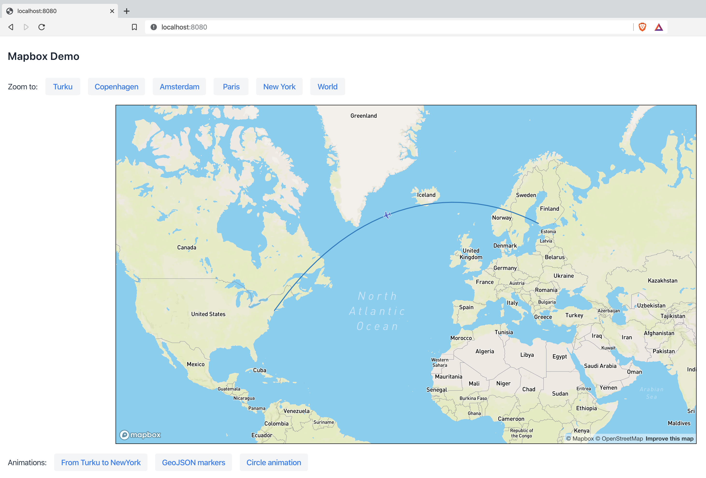

# Mapbox Integration for Vaadin Flow (10+)
Mapbox integration for Vaadin Flow. NB: This project is not affiliated with Mapbox or Vaadin. 

### Characteristics
- Based on Vaadin 14.1.1

### To get started
- Create an account at [Mapbox](https://account.mapbox.com/auth/signup/) and save your API token in a file called `mapbox.properties` that contains the following line (replace by your own token):
    `mapboxgl.accessToken=pk.ayJ1IjoibCFya2htIiRiYSI7ImNrM4ZoazZwcDBtajQzbW2xZHp2c3A4N3BifQ.Y1yevUv4K5gMIqlh2X1v5w`
- To build/run: `mvn jetty:run`
- Open a browser to http://localhost:8080/

### In case or problems
In case of problems with Vaadin, a full clean solves most problems:
- `mvn clean`
- `rm package-lock.json`
- `rm -Rf node_modules`

### Acknowledgements
Feedback and contributions are appreciated.
- Project structure based on [Appreciated](https://github.com/appreciated/)'s [ApexCharts Flow](https://github.com/appreciated/apexcharts-flow) component. 
   
Dec 2019, @markhm.

### Screenshot

